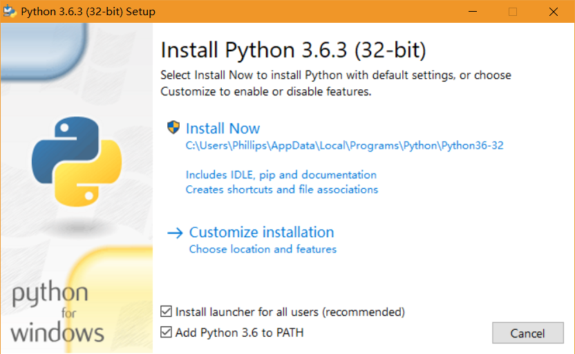

# Path Crawler：基于Python的路径抓取工具

## Path Crawler简介

基于Python3.6和requests工具包，使用Web Map API获取路径数据。

## 安装

### 安装Python3.6

首先从[https://www.python.org/](https://www.python.org/) 选择对应系统的Python3.6下载并安装。（Windows用户直接点击这里下载 [https://www.python.org/ftp/python/3.6.3/python-3.6.3.exe](https://www.python.org/ftp/python/3.6.3/python-3.6.3.exe) ）。推荐在Windows 10系统下安装和运行Python和该程序。

安装过程中，**注意确认勾选Add Python 3.6 to PATH（如图）** 。安装成功即可。



### 获取Path Crawler程序

如果你会使用git，可以在想要放置程序的目录下，通过命令行输入以下代码：

```shell
git clone https://github.com/esdream/PathCrawlerInPython.git
```

如果你不会使用git，可以通过这里[Path Crawler](https://github.com/esdream/PathCrawlerInPython/archive/master.zip)下载压缩包，解压即可。

***如何使用命令行工具？*** 

如果你使用的是Windows，请在“开始”中搜索**PowerShell**，打开后如下图所示：


如果使用的是Windows系统，之后的各项涉及到命令行的操作均推荐使用PowerShell作为命令行工具，这在程序运行时效率更高。

***使用命令行工具进入指定目录的方法*** 

将目录的位置从地址栏处复制下来，打开命令行工具后，在命令行中输入

```shell
cd 目录
```

例如在Windows上使用PowerShell，且PathCrawlerInPython目录的路径为`E:\Codes\PathCrawlerInPython`。将目录路径复制后，在PowerShell中输入`cd`，然后输入一个空格，然后**点击右键**将`E:\Codes\PathCrawlerInPython`粘贴到命令行中，最后回车即可进入到该目录下。如图所示。


### 安装依赖包

获得Path Crawler程序后，打开命令行工具，进入PathCrawlerInPython目录。输入以下命令：

```shell
pip install -r requirements.txt
```

即可完成依赖包的安装。

如果以上命令没有正确安装依赖包，你可以在命令行中输入以下命令：

```shell
pip install requests
```

## 格式化OD数据

你可以从以下链接中下载不同交通方式OD文件的格式。这是一个Excel文件，每个sheet中是**sheet名对应的交通方式的OD文件格式**。

[不同交通方式OD文件格式下载](https://github.com/esdream/PathCrawlerInPython/raw/master/docs/download/od_format.xlsx)

你需要将你的Origin-Destination数据格式化为**按逗号隔开的`.csv`格式文件**。在Excel中，你可以通过“导出”实现这一功能。注意，**OD文件导出时一定要包含表头**！

强烈建议将OD文件转换成**UTF-8**编码。用EXCEL导出的`.csv`文件是GB2312编码，你可以使用Path Crawler提供的[编码转换工具](#文件编码格式转换工具)进行转换。 

你也可以使用其他工具或文本编辑器创建OD文件，格式要求同上。

## 抓取路径数据工具使用方法

格式化完成后，将OD文件放置到`path_crawler/data/od/`目录中。然后打开命令行工具，进入PathCrawlerInPython目录，输入以下命令：

```shell
python -m path_crawler.path_spider
```

Path Crawler中提供了两种Web地图API——百度API和高德API，提供了4种交通方式——驾车（百度，高德），公交（百度），骑行（百度）和步行（百度）。你可以根据OD数据的格式和需要，按照命令行的文字提示，输入对应的参数。

在输入参数过程中如果有输入错误，按**ctrl + c**结束命令，重新输入以上抓取命令即可。

如果命令行显示`The OD file is not existed!`。说明没有将OD数据放置到`path_crawler/data/od/`中。

如果命令行显示`The path data have been crawled.`。说明**输出文件已经存在**，可能该OD文件已经被抓取过。可以修改输出文件名或者将已经存在的输出文件拷贝或删除，重新输入抓取命令即可。

抓取到的路径数据被存储在`path_crawler/data/path_data/`目录中。路径数据是`.db`格式文件，可以下载[sqlitestudio](https://sqlitestudio.pl/index.rvt)打开、查看、查询和导出结果。

### 路径属性

在v1.8版本中，增加了**subpaths**数据库存储子路径及其属性，并从`routes`数据库中移除`path`属性，往后添加了`subpaths`数据库的交通方式中，`path`路径属性均存储于**subpaths**中。以下是各个交通方式下属性的含义：

#### 百度-驾车模式

##### routes

+ id: route id
+ origin_lat: route起点纬度
+ origin_lng: route起点经度
+ destination_lat: route终点纬度
+ destination_lng: route终点经度
+ origin: 起点(可以为县级市、地级市、乡镇等)
+ destination: 终点(可以为县级市、地级市、乡镇等)
+ origin_region: 起点区域(地级市)
+ destination_region: 终点区域(地级市)
+ duration_s: 旅行时间(秒)
+ distance_km: 旅行距离(千米)

##### subpaths

+ route_id: route id, 与routes中的id对应
+ step_num: subpath的编号，表示第`route_id`中的第`step_num`条子路径
+ start_lat: subpath起点纬度
+ start_lng: subpath起点经度
+ end_lat: subpath终点纬度
+ end_lng: subpath终点经度
+ sub_s: subpath旅行时间(s)
+ sub_km: 旅行距离(千米)
+ area: 标示该路段是否在城市内部：0：不在城市内部；1：在城市内部
+ traffic_status: 路况。0：无路况；1：畅通；2：缓行；3：拥堵
+ geo_cnt: 从subpath起点开始，路况相同的路段数（1个路段是指：相邻两个坐标点间的区间）
+ path: 路径点。`lng1,lat1;lng2,lat2;...`


## 处理错误

### 处理抓取错误

在1.5.1版本中，Path Crawler会自动处理抓取错误的文件，无需手动处理。

### 处理解析错误

如果OD数据某一条数据在抓取时出现了解析错误，则会被记录在`input-filename.csv`文件中并放置在`path_crawler/data/parse_error/` 目录下。

一般情况下，出现解析错误的原因是该类型Web地图API或该种交通方式下，无法正确获取路径。你需要将这一csv文件复制至`path_crawler/data/od/`目录中并使用另一种Web地图API或交通方式抓取。

## 其他工具

### 地理编码工具

转换地址名称与坐标。

#### 使用方法

首先，将你的地址数据按照以下格式存储为**`.csv`文件（以UTF-8编码）**，存储时包含表头。

| id   | address | city |
| ---- | ------- | ---- |
|      |         |      |

然后将该文件放置到`path_crawler/data/geo_encoding/`目录中。

最后打开命令行工具，进入PathCrawlerInPython目录，运行以下命令：

```shell
python -m utils.geo_encoding
```

运行完成后，编码完的数据存储在`path_crawler/data/geo_encoding/`中。

### 文件编码格式转换工具

将其他编码文件转换成UTF-8编码。

#### 使用方法

首先将你的`.csv`文件放置到`path_crawler/data/od_data/`目录中。

然后运行以下命令：

```shell
python -m utils.to_utf8
```

运行完成后，编码成UTF-8格式的文件存储在`path_crawler/data/od_data/`目录中，以`输入文件名_utf8.csv`的格式命名。

### POI搜索工具

在指定范围内搜索POI数据。

#### 源数据处理

POI搜索工具提供了**关键字搜索、周边搜索、多边形搜索**三种搜索方式。你可以在以下链接中下载不同搜索方式对应的源数据格式。这是一个Excel文件，每个sheet中是**该sheet名称对应的搜索方式的源数据格式与样例数据**。

[POI搜索工具源数据格式](https://github.com/esdream/PathCrawlerInPython/raw/master/docs/download/poi_format.xlsx)

你需要将你的POI数据格式化为**按逗号隔开的`.csv`格式文件**。在Excel中，你可以通过“导出”实现这一功能。注意，**POI文件导出时一定要包含表头**！

强烈建议将POI文件转换成**UTF-8**编码。用EXCEL导出的`.csv`文件是GB2312编码，你可以使用Path Crawler提供的[编码转换工具](#文件编码格式转换工具)进行转换。

不同搜索方式源数据参数如下。

##### 关键字搜索

+ id：搜索编号。
+ keywords：关键字，多个关键字用"|"分割。
+ types：查询POI类型。多个类型用"|"分割。可以使用分类代码或汉字，需要严格按照[高德地图POI分类编码表](https://github.com/esdream/PathCrawlerInPython/raw/master/docs/download/%E9%AB%98%E5%BE%B7%E5%9C%B0%E5%9B%BEAPI%20POI%E5%88%86%E7%B1%BB%E7%BC%96%E7%A0%81%E8%A1%A8.xlsx)输入。分类代码由六位数字组成，一共分为三个部分，前两个数字代表大类；中间两个数字代表中类；最后两个数字代表小类。若指定了某个大类，则所属的中类、小类都会被显示。
+ city：查询城市。可以用城市中文、中文全拼、citycode、adcode。强烈*建议使用**adcode**，参见[高德地图城市编码表](https://github.com/esdream/PathCrawlerInPython/raw/master/docs/download/%E9%AB%98%E5%BE%B7%E5%9C%B0%E5%9B%BEAPI%20%E5%9F%8E%E5%B8%82%E7%BC%96%E7%A0%81%E8%A1%A8.xlsx)。

##### 周边搜索

+ id、keywords、types、city：同关键字搜索。
+ location：中心点坐标。lng, lat 格式，经度在前，纬度在后。
+ radius：查询半径，取值范围0 - 50000，单位：米。
+ sortrule：排序规则，按距离排序该字段设为distance，综合排序设为weight。

##### 多边形搜索

+ id、keywords、types、city：同关键字搜索。
+ polygon：多边形经纬度坐标对。lng, lat格式，经度在前，纬度在后，坐标对用"|"分割。多边形为矩形时，可传入左上右下两顶点坐标对；其他情况下首尾坐标对需相同。

#### 使用方法

首先将你的`.csv`文件放置到`path_crawler/data/poi/`目录中。

然后在命令行运行以下命令：

```shell
python -m utils.search_poi
```

运行完成后，编码成UTF-8格式的文件存储在`path_crawler/data/poi/`目录中，是一个`.db`文件，其中id相同的行是同一次搜索中得到的结果，使用sqlitestudio打开并导出即可。

### 坐标转换工具

将源坐标转换成百度地图采用的经纬度坐标。

#### 使用方法

将你的源坐标文件格式化成以下格式并存储在`.csv`文件中.

```
id,lat,lng
1,lat1,lng1
2,lat2,lng2
```

然后将格式化后的源坐标文件放置在`path_crawler/data/od_data/`目录中。运行以下命令：

```powershell
python -m utils.geoconv
```

运行完成后，结果文件存储在`path_crawler/data/od_data/`中，以`输入文件名_conv.csv`命名。

抓取错误文件和解析错误文件分配存储在`path_crawler/data/crawl_error/`和`path_crawler/data/parse_error/`中，请分别对他们进行单独处理。